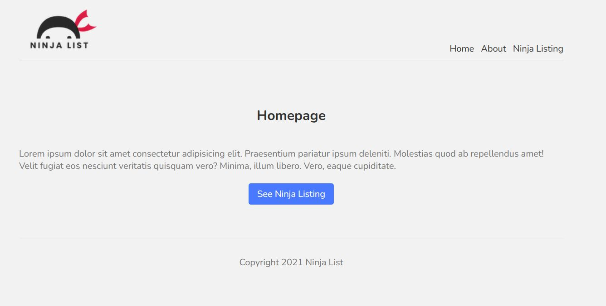

# List of people

### What is the project about?

The project is a Next.js web application that lists all kinds of people and their information.

### Is the app deployed somehwhere?

Yes, it is deployed on Vercel. You can click [here](https://list-of-people.vercel.app/) to see it.

### Preview

### How can I download the project?

1. Run **git clone github.com/andersonrbernal/list-of-people.git** to clone the project to a directory on your computer.
2. Open your terminal and run **npm install** to download the dependencies.
3. Run **npm run dev** and a local server will be created temporarily on your machine.
4. Click on the link appears on your terminal.
5. Done, now you can interact with the app.

### Why did you do this project and what was it for?

I created this simple project in Next.js because I wanted to test my abilities with React without having to worry about performance. It was for my experience, and that alone. I like experimenting new things because it is very refreshing for me.

### How can I contact you?

email: andersonbernal2017@gmail.com
Linkedin: https://www.linkedin.com/in/anderson-bernal/
github: https://github.com/andersonrbernal
